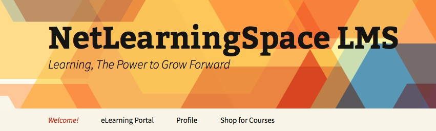

So we have come to the end of this series of articles on Building an LMS using WordPress. My hope in creating and posting this series that some of you will feel empowered to go out an create your own LMS for you or your organization. **Final Tally** First I wanted to show you how much it did cost me to create my site:

- I spent approx. $500
- I have 14 plugins actively running
- I have a full eCommerce site
- I can manage my client projects
- At the moment I have 3 courses on offer for sale, with more to come

I did spend a lot of time creating all of this, but much of that was exploring all the options so I could decide what was best for me. Hopefully this series has reduced that time for you.

I think this type of LMS is awesome for many kinds of organizations, from Not-for-profits, member associations, to small and medium size companies who need to train and develop elearning modules for their employees or customers and don’t want to spend large sums of money. As I previously mentioned, there are some great open-source LMS programs out there, but many require more IT resources than most small companies have available to them.

**THIS IS A PERFECT ALTERNATIVE!** 

Choosing an LMS and how it is created/installed is as important as the content. If it is difficult for a learner to use or get to the learning, then they are likely to not complete it. Many large ERP systems have way too many clicks to get to where a learner needs to be and therefore, engagement is diminished.

I hope what this series has also given you is the feeling that there is a viable option for all organizations, regardless of your size. FInally, if you want to see how it works, or want to test out my own LMS, here is the link [lms.netlearningspace.com](http://lms.netlearningspace.com)

I am happy to answer any questions you may have or start a conversation of how you too can create a great LMS using WordPress.

Cheers!