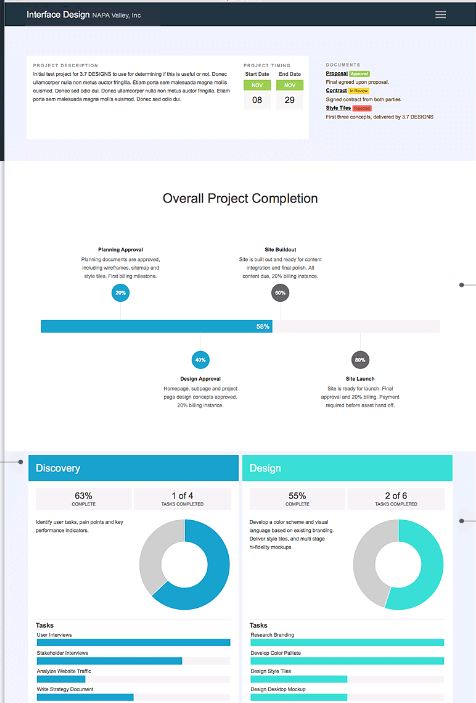

This is the second to last article on Building an LMS using WordPress. We have looked at all the of plugins I used and my last article will be my observations and some tips.

For this article, I wanted to expand on some plugins I am not using but may benefit some of you. As I was looking for my features, I also found the following:

Eve**nt Calendar Plugins**

This group of plugins is about being able to provide a calendar of events, allowing people to book space and even pay for courses in the classroom or if online, a webinar. There are two that I found useful, the first is Event Espresso, which is a full, robust events planning plugin and has integration with LearnDash.

The other was more simple to use plugin, called Events Manager. I demonstrated this one for my CSTD event, and has lots of features.

 

**Project Management**

As a Learning Consultant, I am always working with clients, usually on a project basis and need to keep them informed of where I am on the various tasks. Instead of fielding dozens of questions, phone calls or emails, I have installed a plugin called Project Panorama.

This plugin offers me the ability to set up a client project, password protect it so only they and I can see the progress, and allows my clients to view the status of a task or then entire project without contacting me all the time.

This is very helpful, especially if you work remotely with clients.

You can add documents, like the project or training plan, and update the status using percentages. It is easy for me and for the client. Here is what a project may look like….

So my last thought for this post is to think of all the things you want for your LMS, the features that will work for you, or your client and then search for them as a WordPress plugin. It is very possible there is one already developed by someone. Yes, some cost money but many don’t.

The benefits to you and your clients are high and if you sell your courses, in the classroom or online, there is a plugin that will help you perform these functions. The sky is the limit.

One last post to go, my final words about Building an LMS using WordPress, next week.

Cheers!

   

 ga('create', 'UA-52738692-1', 'auto'); ga('send', 'pageview');